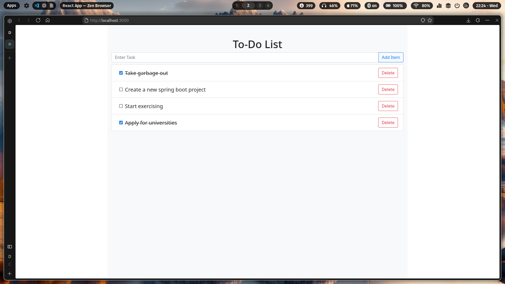

# To-Do List App (React + Spring Boot)

A simple to-do list app created using React for the frontend and Spring Boot for backend. Uses H2 database (in-memory).

 

To run the app, you will need to run both the backend and frontend separately.

- **To run the backend**

```sh
$ cd to-do-backend

$ mvn spring-boot:run
```

- **To run the frontend**

```sh
$ cd to-do-frontend

$ npm start
```

- The UI will be available at [http://localhost:3000]

## To Do
- [x] Migrate to Typescript
- [ ] Refactor code -- multiple copies of method signature across components